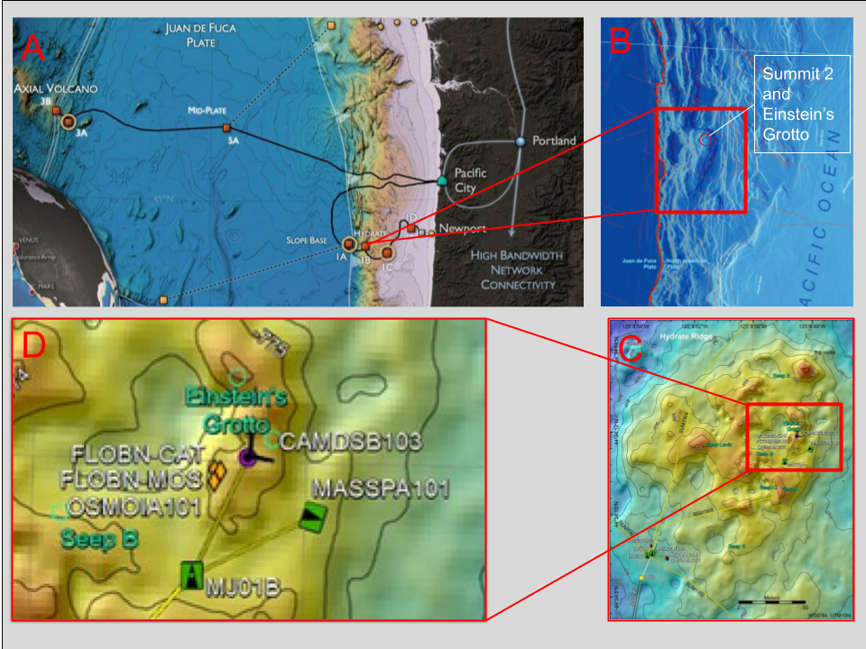
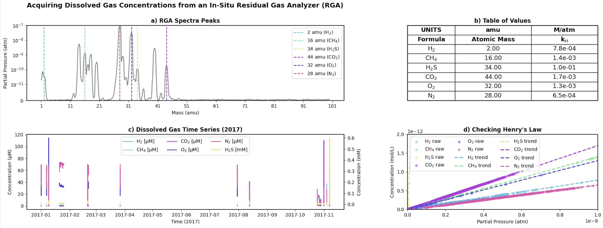
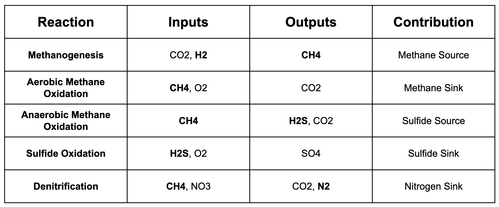
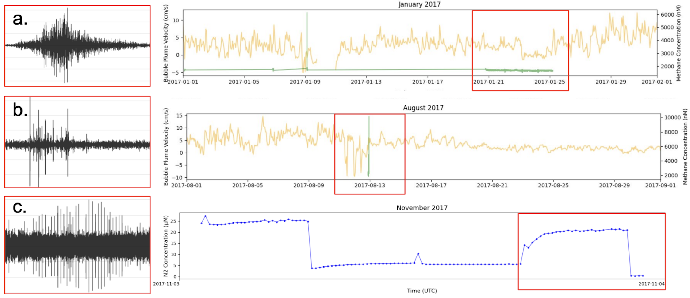
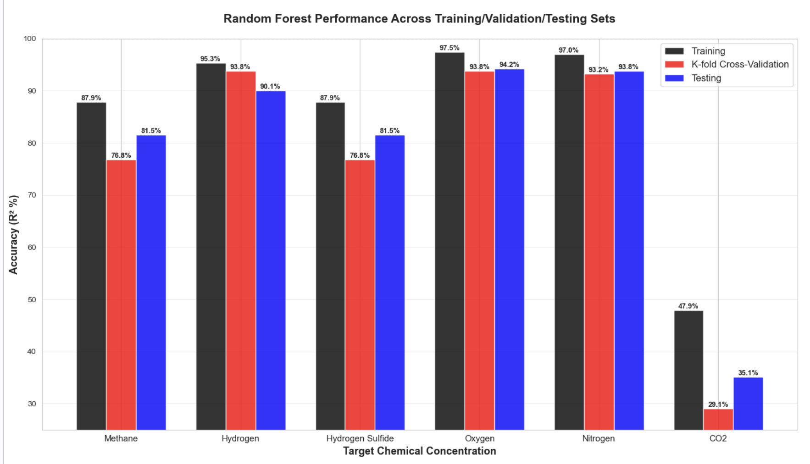
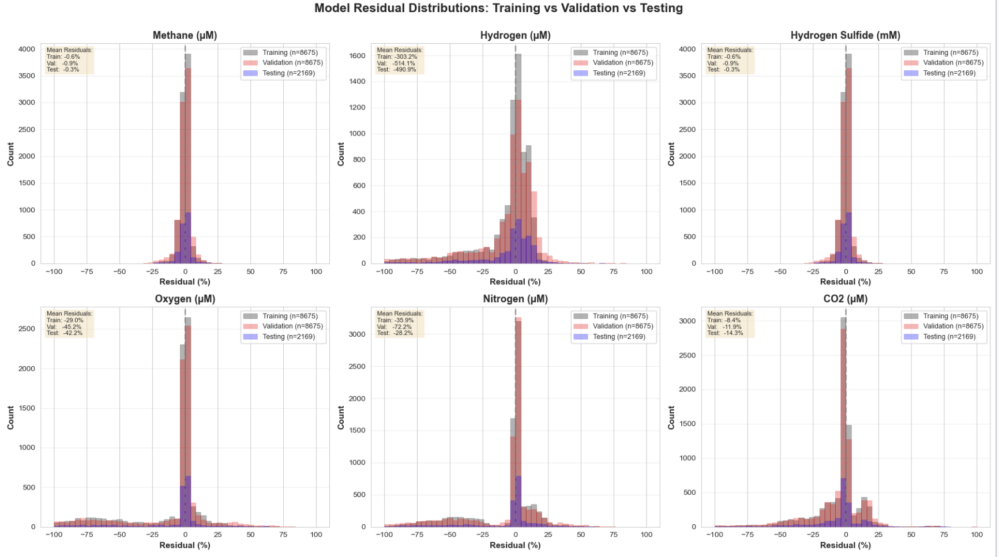
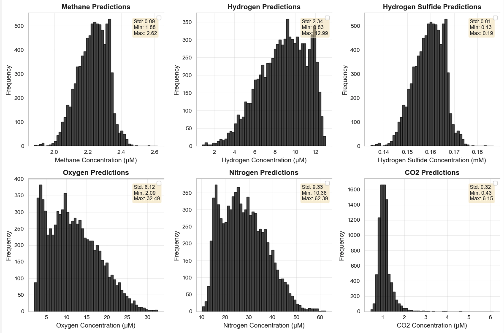

# Estimating Seep Chemistry at Southern Hydrate Ridge
**Contributors:** Michael Hemmett, Christina Stuhl, David Lovett, and Isaac Olson

Write-up authored by Michael Hemmett for ESS 569.

## Team
**Christina Stuhl:** ESS and OCEAN 3rd year undergraduate student. Responsible for extracting acoustic features, detrending acoustic velocity profiler data with pressure gauge tidal data, and for processing chemical data from the residual gas analyzer instrument (RGA).

**David Lovett:** ESS 4th year undergraudate student. Responsible for preparing regression targets from raw mass spectrometer data and mapping the geological site of interest.

**Michael Hemmett:** ESS first-year graduate student. Responsible for extracting and processing seismic features, as well as training, testing, and evaluating the random forest model.

## Introduction
Methane seeps are undersea sites where methane hydrates, sediments with methane trapped in water ice, release methane gas into the ocean through long-lived bubble plumes, (Phillip et al., 2016). These cold seeps are hot spots of marine life in the deep ocean. They host significant ecosystems centered around chemosynthetic organisms fed by seep methanogenesis (Reeburgh et al., 2007; Römer et al., 2014; Treude et al., 2003; Tryon et al., 2001). Methane plume activity is highly episodic and nonlinear, driven by tides, regional seismicity, and the spontaneous break down of methane hydrates. The fluctuations in methane availability control the chemosynthetic ecosystem that drive larger scale marine life dynamics at these sites. Despite their biogeochemical significance, methane seep chemistry is often under-monitored. Chemical monitoring in the deep ocean is limited by instrumental constraints, namely, mass spectrometers developed for automated offshore seawater sampling have short lifetimes, and calibration errors after deployment can lead to data gaps. The issue of instrumentation must be addressed to better constrain how ecosystem dynamics relate to seawater chemistry at methane seep sites.

Southern Hydrate Ridge (SHR) is a methane seep site in the Northeast Pacific Ocean, located offshore Newport, Oregon. Located at a depth of 700 m in the anoxic zone, this site was generated as hydrates were buried and uplifted on the Cascadia Subduction Zone accretionary wedge complex, (Luff et al., 2008). Multiple methane plumes drive a unique marine ecosystem, including several protected species of marine organisms significant to the Pacific Northwest fisheries industry, including the rock fish. Additionally, marine mammals such as fin whales pass this site during annual migrations. This site is highly instrumented as part of the Ocean Observatories Initiative (OOI) Regional Cabled Array, including broadband and short-period seismometers, ocean-bottom pressure gauges, an acoustic doppler velocity profiler (ADCP) and a mass spectrometer RGA, for seawater chemical analysis. The seismometers sit 100 m away from the Summit A site where the other instruments are located. Summit A is also known as "Einstein's Grotto."

**Figure 1:**  Three maps of Southern Hydrate Ridge that provide visual and spatial context for our project and just exactly how small our special extent actually is.

(A) Ocean Observatories Initiative infographic showing the Cable Array, Axial Seamount, Portland, and each important node on the Array. 

(B) Topographic and Bathymetric map from the Oregon State Library at 1:500,000 scale zoomed in on Southern Hydrate Ridge itself. 

(C) A topographic map colored by altitude from the OOI website, ultimately provided by a previous UW team. This figure gives us a very detailed picture of SHR’s Summit 2 local structure as well as instrument locations. 

(D) Figure (C) but zoomed in on Einstein’s grotto, showing our instruments; MASSPA101 is the Residual Gas analyzer, MJ01B is the junction box with the bubble velocity meter and pressure gauge.

Data from the non-commercial RGA instrument is sparse across its years of operation, with a short expected lifetime of one year for the instrument. This poses a significant challenge for monitoring methane availability in this unique ecosystem. Meanwhile, commercial, physical instruments such as pressure gauges, ADCP, and seismometers collect continuous time series data at the same site, with expected lifetims of up to five years. To address the challenge of limited chemical monitoring, we develop a fast machine learning (ML) algorithm mapping robust physical measurements to chemical concentrations at SHR. The algorithm serves to map nonlinear relationships between acoustic backscatter magnitude and short-duration seismic events and frequency content to relevant dissolved gases constraining seep chemistry across time, with potential for future real-time implementation on seafloor instruments.

## Background and Instrumentation
### Seep Chemistry - RGA
The RGA mass spectrometer instrument uses a permeable membrane to intake seawater, calculate the pressure of a range of atomic masses in the sample, and reset for the next reading. This sampling process takes 22 seconds, (OOI). Pressure readings that spike at an atomic mass unit of significance can be converted to partial pressure by dividing the pressure of the peak of interest by the sum of all pressure readings in the sample. Partial pressures can then be converted to aqueous concentrations of dissolved gases using Henry's Law. For small concentrations relative to the whole of the sample, this conversion can be approximated in the linear regime of Henry's Law, $C = k_{H} * P$, where $C$ is concentration, $P$ is partial pressure, and $K_{H}$ is a temperature- and depth-dependent linear constant specific for each dissolved gas.

**Figure 2:** RGA Data Acquisition. A comprehensive overview of the extraction methods for the TGA at SHR Summit A. Each RGA .txt file included a spectra of values associated with the partial pressure (Torr) of a specific gas identified by an atomic mass (amu).

(A) Features a single .txt file from one measurement taken by the RGA in 2017, and includes markers identifying the gases selected for this study.

(B) Includes the Henry's Law constant values $k_{H}$ that were used to convert each partial pressure into a concnetration that could be understood.

(C) A time series of 2017 without interpolation, i.e. a NaN value does not equal zero so when the instrument is not active no data is displayed.

(D) A check verifying that the calculated values obey Henry's Law. Each trend obeys the law $C = k_{H} * P$, such that $k_{H}$ is always the Henry's Law constant provided in Table (B).

This concludes the process by which concnetration data was collected from the RGA.

At SHR, the dissolved gases that best constrain seep chemistry are methane gas ($CH_{4}$), a direct product of methanogenesis from the seep methane hydrate breaking down, hydrogen sulfide ($H_{2}S$), a product of the central chemosynthetic process for which methane is a reactant (Sahling et al., 2002), and hydrogen gas ($H_{2}$). Three other trace gases that constrain the seawater chemistry at the seep site are nitrogen gas ($N_{2}$), relevant for isolating marine mammal signatures, oxygen gas ($O_{2}$), and carbon dioxide ($CO_{2}$). These gases and their role in methane sources and sinks at the seep site are included in Table 1.

**Table 1:** Dominant aqueous reactions that serve as sources and sinks of methane gas, hydrogen sulfide, and nitrogen gas at SHR.

### Physical-Chemical Correlation
ADCP instruments deployed at SHR measure seawater velocity at methane plume sites using active sonar. Radar pulses reflect off of gas bubbles and particles in the seawater to record an ambient seawater velocity across time, (OOI). The strength of the acoustic backscatter magnitude reflected off of plume bubbles has been established as a nonlinear proxy for the concentration of methane gas in seawater, (Phillip et al., 2016).

Unidentifiable non-seismic signals detected on a single ocean-bottom seismometer (OBS) are known as short-duration events (SDEs). These events are not earthquakes, ship noises, whale calls, or other clearly identifiable non-seismic events. Near SΗR, seismometers have recorded SDEs that could correspond to spontaneous explosive methane seep events, but without additional data sources, these signals cannot be separated from biological activity - i.e, a fish bumping the sensor, (MacLeod et al., 2025; Marcon et al., 2021). Each SDE carries a particular seismic signature characterized by its duration, amplitude, and spectral content. Additionally, an explosive methane venting event would coincide with a noticeable increase in the concentration of dissolved methane, and subsequently, dissolved hydrogen sulfide. This establishes a nonlinear relationship between seismic features derived from a seismometer co-located with the seeps, as well as methane seep activity at SHR. Features derived from seismic data will be used as an input for training an ML model to map physical sensor data to chemical activity.

Combined together, these two physical measurements capture distinct and complementary nonlinear relationships between physical signals and seep chemistry, which we will capture with ML.

## Data: Inputs and Outputs
While all instruments were deployed for multiple overlapping years in the period of 2015-2018, not all instruments collected data in these times. Additionally, RGA data is very sparse and the majority of the measurements available on the OOI raw data site were taken during 2017.

We download all processed RGA spectra in text files from the OOI raw data site for the MASSPA101B instrument, the RGA mass spectrometer located at SHR Summit 2. We extract peaks for the six dissolved gases relevant to capturing seep chemistry and calculate partial pressures for each at the timestamps provided in the titles of the data text files. We then use Henry's Law and six distinct constants for the expected seawater temperature, the depth of SHR at 700 m, and the relevant dissolved gas, to calculate gas concentrations in seawater. These constants were extracted from a reference table developed by NOAA. There were a total of 29,770 RGA measurements in 2017. We interpret the RGA timestamps as the time at which the sample was collected, or the start of a 22-second window corresponding to the mass spectrometer measurement period. From these, we construct a set of 29,770 22-second timestamp periods into which seismic and acoustic features could be processed and binned.

Seismic data was pulled from the EarthScope Consortium database for all periods in 2017, using the broadband seismometer OO.HYS14 located 100 m from the Einstein's Grotto plume site. We download data for all three components, ZNE, in a 22-second period, then perform basic pre-processing. This includes a linear detrend, a 5% Hanning window taper at the edges of the window, and a 2 Hz highpass filter to remove surface wave noise. We then extract the mean amplitude, dominant power spectral density, and dominant frequency for each component in each window. These are saved as seismic features for the corresponding timestamp.

Acoustic data was pulled from the OOI data center site for the SHR ADCP instrument at Summit 2, with water velocities extracted on an hourly basis. First, the background water velocity is subtracted from the acoustic time series. Next, a co-located ocean-bottom pressure gauge record of tidal seasonality is used to subtract velocity trends correlated to the tides. Then, for each 22-second window with data in the corresponding hour, the mean, median, maximum, and minimum plume acoustic velocities are calculated and saved as acoustic features for that timestamp. Approximately 11,000 of the original 29,770 timestamps possessed data for the chemical, seismic, and acoustic data.

Combining the nine seismic features, three for each component, plus two features representing the mean dominant frequency and mean seismic amplitude across all three components, and lastly the four acoustic velocity features, a total of fifteen physical features are used as training features for the ML model. The six dissolved gas concentrations extracted from the RGA data and calculated with the appropriate Henry's Law constants are used as the ML regression targets.

The training dataset captured a variety of events that the ΜL model will distinguish and constrain. First, explosion-like non-seismic events occur at the same time as dramatic increases in acoustic velocity and methane concentration. These likely capture SDE methane venting, the primary event type for the ML model to constrain. Secondly, unrelated SDEs that do not correspond with changes in the acoustic velocities or seep chemistry. Third, a high concnetration of fin whale calls during migration events along the Oregon coast in the end of January. This corresponds to a dramatic peak in nitrogen concentration, but no change in seep dynamics. This captures whale waste and bioturbation, wherein whales dive deep for food and resurface, thereby vertically cycling the water column.

**Figure 3:** A variety of non-seismic SDEs compared to mean acoustic velocity (gold), with methane (green), and nitrogen concnetrations (blue). SDE samples are seconds-long, extracted from within the highlighted time periods shown on the right.

(A) A rumbling seismic signal uncorrealted to seep activity.

(B) Whale calls on top of a potnetial. SDE linked in time with a sharp increase in methane concentration and above average acoustic velocity. This could signify a seep event.

(C) Significant whale activity corresponding with an increase in nitrogen concnetration, potentially due to whale waster or bioturbation.

## Machine Learning Implementation
We developed two distinct ML model implementations in tandem: first, a simple SciKitLearn random forest (RF) model using the extracted features described above as inputs, and the second, a PyTorch convolutional neural network (CNN) model trained on extracted acoustic features and full seismic timeseries data for the corresponding 22-second period. Preliminary testing showed promising results from the RF model, with poor performance from the CNN model; thus, the RF model was chosen for the final implementation.

In an RF model, bootstrapping and resampling is built into the base model architecture so that no portion of the dataset is undersampled. This is highly relevant for the chemical data, for which there were few high concentration outliers in 2017. The final model used 800 trees and a maximum tree depth of 12. The number of trees corresponds to the number of unique samples of the dataset used in training, where in the coresponding input features are mapped to the corresponiding chemical targets through a number of binary splits or decisions up to the maximum tree depth. For an RF model, the power is in using many trees with a shallow depth for maximum parallelizability and rapid implementation on hardware. In our dataset, a maximum tree depth of 16 resulted in overfitting, but a depth of 12 resulted in robust model performance across training, validation, and test sets.

We used a training, validation, and test set split of 70%, 15%, and 15%, respectively. After the initial model was trained, a five-fold K-fold cross validation was performed, wherein the 15% of validation data is split into five randomly sampled, equal-sized groups. The model is retrained on each possible combination of four out of the five validation sets, then tested on the remaining set. This informed updates to the model weighting scheme, and a final model that integrated perforamnce across all validations sets and the training set was produced. We then tested the model on the remaining, unseen test set from 2017 data.

## Results and Discussion
The RF model showed an average training set and validation set $R^{2}$ accuracies of approximately 90%, with a test set accuracy of approximately 85%. The small gap between training, validation, and test set accuracies shows that overfitting was minimized while maintaining a high performance on unseen data. This held true for all dissolved gas concentrations except carbon dioxide, which showed a model accuracy of less than 50% and a large gap in performance between the training, validation, and test sets. This suggests that the extracted physical features largely capture the variance in the seep chemistry related to methane venting signals, but does not constrain carbon dioxide concentration that is likely driven by other factors not present in the training features; thus, the model overtrains on the carbon dioxide target but performs well on other chemcial concentrations.

**Figure 4:** RF model accuracy for all six dissolved gas concentrations across training, K-fold validation, and test sets.

By analyzing model residuals across the training, validation, and test sets, it is clear that methane gas and hydrogen sulfide gas show symmetric, sharp peaks with minimal residuals. The interpretation is that the model is accurately predicting these two gas concentrations, which are the most significant for constraining seep activity. The other four trace gases show irregular distributions, long tails, and large residuals, suggesting the RF model often inaccurately predicts values for these concentrations.

**Figure 5:** RF model residuals for all six dissolved gas concentrations across training, K-fold validation, and test sets.

We then prepared physical inputs from January 2016, a month for which there is little RGA data, extracting 22-second seismic features every five minutes across the month to reduce computational load. After predicting chemical concentrations for January 2016 with the trained RF model, output distributions show little fluctuation and a small spread of concentrations. Without additional RGA data to evaluate model accuracy and residuals, the model performance in this unseen time period remains ambiguous. Based on the results in 2017, the model performance may be well-constrained, showing there is no significant methane venting across the month. Further testing is needed to confirm the model's generalizability to other time periods and datasets.

**Figure 6:** RF model predictions for all six dissolved gas concentrations in January 2016.

## Future Work
This model shows promising preliminary results characterizing methanogenesis with seismic and acoustic velocity monitoring. In the future, additional processed RGA .txt files could be extracted from the OOI raw data website to expand the model dataset beyond 2017, both to reduce the impact of overfitting on the noise profile of 2017, and to allow rigorous model testing on data from unseen years. After the model has been fine-tuned, we plan construct input seismic and acoustic features across all years that both the seismometer and ADCP were operational to "fill in the gaps" where the RGA did not collect data. This would generate new datasets for multi-year chemical monitoring at a significant chemosynthetic ecosystem on the seafloor.

Future implementations of this method could be developed for other methane seep sites, such as in the Atlantic Ocean, though site-specific bathymetry and chemistry would likely require developing a model from scratch, rather than integrating transfer learning. In the Northeast Pacific, this method could be applied to hydrothermal vent fields on Axial Seamount. These sites have broad spatial and temporal coverage with seismic and ADCP instruments, but with limited RGA mass spectrometer coverage like SHR. Hydrothermal vents cycle trace iron, the bio-limiting nutrient in the oceans, and venting productivity may be correlated to submarine volcano eruption cycles; thus, this model could help quantify how mid-ocean ridge volcanism drives trace iron availability and marine ecosystems in the deep ocean.

## Conclusions
Methane seep sites host dynamic chemosynthetic ecosystems on the seafloor, but little chemical monitoring leaves unanswered questions about how seep variability controls ecosystem dynamics. Additionally, the problem of non-seismic SDEs at methane seep sites remains unresolvable without additional data. By constraining methane seep chemistry with related physical measurements of methane bubble plume dynamics, we develop an RF model to predict seep chemistry using long-lasting, reliable instruments, with potential to identify SDEs using single seismic station data. While initial results show promising performance on a fast ML architecture, expanded and rigorous assessment on model generalizability is needed before pursuing model deployment on seafloor hardware.

## Citations
MacLeod, L. M. F., & Wilcock, W. S. D. (2025). Nonseismic short-duration events offshore Cascadia: Characteristics and potential origin. Seismological Research Letters, 96(2A), 706–720. [https://doi.org/10.1785/0220240367](https://doi.org/10.1785/0220240367)

Marcon, Y., Kelley, D. S., Thornton, B., Manalang, D., & Bohrmann, G. (2021). Variability of natural methane bubble release at Southern Hydrate Ridge. Geochemistry, Geophysics, Geosystems, 22, e2021GC009894. [https://doi.org/10.1029/2021GC009894](https://doi.org/10.1029/2021GC009894)

Ocean Observatories Initiative. "Regional Cabled Array." https://oceanobservatories.org/

Philip, B. T., A. R.Denny, E. A.Solomon, and D. S. Kelley (2016). Time-series measurements of bubble plume variability and water column methane distribution above Southern Hydrate Ridge, Oregon, Geochem. Geophys. Geosyst., 17, 1182–1196, doi:10.1002/2016GC006250. 

Reeburgh, W. S. (2007). Oceanic methane biogeochemistry. Chemical Reviews, 107(2), 486–513. [https://doi.org/10.1021/cr050362v](https://doi.org/10.1021/cr050362v)

Römer, M., Sahling, H., Pape, T., Bahr, A., Feseker, T., Wintersteller, P., & Bohrmann, G. (2014). Microbial abundance and diversity patterns associated with sediments and carbonates from methane seep environments of Hydrate Ridge, Oregon. Frontiers in Marine Science, 1, Article 44. [https://doi.org/10.3389/fmars.2014.00044](https://doi.org/10.3389/fmars.2014.00044)

Sahling, H., Galkin, S. V., Salyuk, A., Greinert, J., Foerstel, H., Piepenburg, D., & Suess, E. (2002). Macrofaunal community structure and sulfide flux at gas hydrate deposits from the Cascadia convergent margin, NE Pacific. Marine Ecology Progress Series, 231, 121–138.

Treude, T., Boetius, A., Knittel, K., Wallmann, K., & Jørgensen, B. B. (2003). Anaerobic oxidation of methane above gas hydrates at Hydrate Ridge, NE Pacific Ocean. Marine Ecology Progress Series, 264, 1–14.

Tryon, M. D., Brown, K. M., & Torres, M. E. (2001). Complex flow patterns through Hydrate Ridge and their impact on seep biota. Geophysical Research Letters, 28(15), 2863–2866. [https://doi.org/10.1029/2000GL012566](https://doi.org/10.1029/2000GL012566)

Luff, R., Wallmann, K., Aloisi, G., et al. (2008). Miniaturized biosignature analysis reveals implications for the formation of cold seep carbonates at Hydrate Ridge (off Oregon, USA). Biogeosciences, 5, 731–741.

